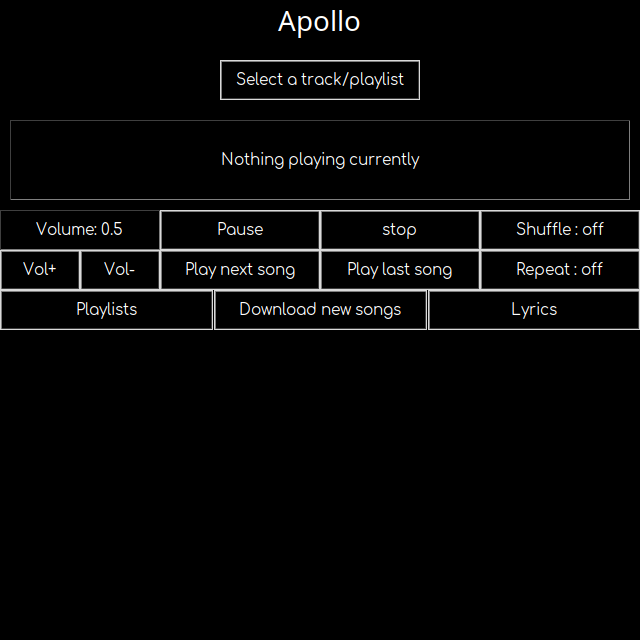

# Apollo

Personal desktop music player built with Tkinter and Pygame.



## Features

- Play local MP3s with full playback controls — pause/resume, volume, skip, shuffle, repeat
- Load playlists from `.txt` or `.csv` files
- Search YouTube and download songs (requires a YouTube Data API key)
- Fetch lyrics for the current song via the Genius API
- Create and manage CSV playlists (add / delete songs)

## Companion scripts

| Script | What it does |
|---|---|
| `Lyrics.py` | Batch-tags MP3 files with lyrics fetched from Genius (with a manual review step) |
| `beatspermin.py`, `energism.py`, `Energism2.py` | Spotify track analysis (BPM, energy) for building workout playlists |
| `find_dupes.py` | Finds duplicate files and produces a report |
| `codec converter.py` | Batch-converts `.m4a` to `.mp3` |
| `fixer.py` | Counts duplicate files across playlist folders |
| `vlcshort.py` / `vlcshort.vbs` | VLC HTTP interface shortcuts |
| `ytdlpdownload.py`, `pytubedownload.py`, `videodownloader.py`, `quick download.py` | YouTube / yt-dlp download helpers |
| `yt-dlp.conf` | Local yt-dlp configuration (output format, cookies, ffmpeg path) |

## Requirements

- Python 3.12+
- `ffmpeg` on your PATH (used for audio conversion/merging)
- `yt-dlp` (installed automatically with the requirements)

## Setup

```bash
python -m venv .venv
.venv/bin/pip install -r requirements.txt
```

On Windows:

```powershell
python -m venv .venv
.venv\Scripts\pip install -r requirements.txt
```

## Environment variables

API credentials are read from the environment, never hardcoded:

| Variable | Used by | Needed for |
|---|---|---|
| `YOUTUBE_API_KEY` | `Apollo.py`, `pytubedownload.py` | YouTube search / download |
| `GENIUS_ACCESS_TOKEN` | `Apollo.py`, `Lyrics.py` | Lyrics lookup |
| `GENIUS_CLIENT_ID` / `GENIUS_CLIENT_SECRET` | `Apollo.py`, `Lyrics.py` | Genius OAuth (access token is usually enough) |
| `SPOTIFY_CLIENT_ID` / `SPOTIFY_CLIENT_SECRET` | `beatspermin.py`, `energism.py`, `Energism2.py` | Spotify API |
| `MUSIXMATCH_API_KEY` | `Lyrics.py` | Currently unused |

Example:

```bash
export YOUTUBE_API_KEY="your-key"
export GENIUS_ACCESS_TOKEN="your-token"
```

## Usage

```bash
.venv/bin/python Apollo.py
```

## Notes

- Several scripts contain legacy hardcoded paths (e.g. `D:\shaarav\...`) from earlier Windows usage — update these to match your own music library locations.
- Personal data files (`processed_songs.txt`, `dupes-report.html`, etc.) are gitignored and stay out of the repository.

## License

[MIT](LICENSE)